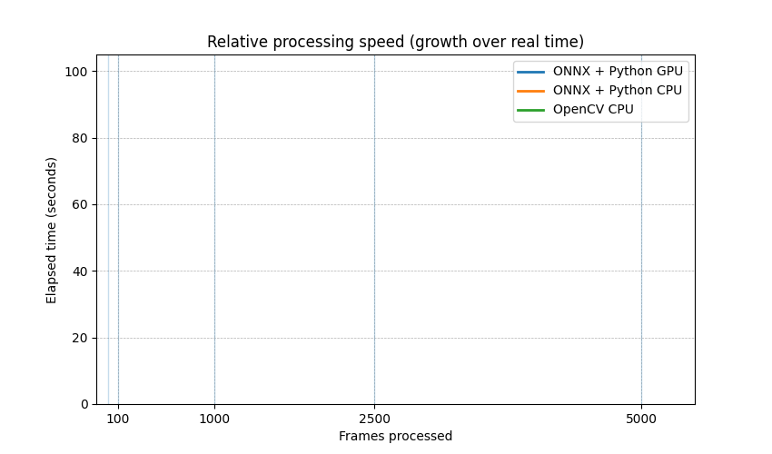

# YuNet-GPU

While working on Face Detection & Recognition at (company name) I came across a lightweight face detector model — **YuNet**.

You can use it through the OpenCV Python library and it’s really easy, but GPU inference often means building OpenCV with CUDA support, which can be painful and can also cause conflicts with other dependencies.

The other way to use YuNet is via the **ONNX weights**, but those don’t come with pre/post-processing.  
So in my free time I went through the OpenCV source code and replicated their post-processing from C++ in Python using **torch**, with some small changes to increase speed.

**End result:** this repo combines the **YuNet ONNX model** + **Python (torch) post-processing** so you can get the speed benefits without needing a custom OpenCV build.

---

## Benchmarks

Test setup:
- Device: **Apple M1 Pro**
- Resolution: **1280×720**
- Metric: total runtime for processing `N` images (seconds)

| Images | ONNX GPU (s) | ONNX CPU (s) | OpenCV (s) | GPU speedup vs OpenCV | CPU speedup vs OpenCV |
|------:|-------------:|-------------:|-----------:|-----------------------:|-----------------------:|
| 10    | 0.100        | 0.155        | 0.226      | 2.26×                  | 1.46×                  |
| 100   | 0.971        | 1.533        | 2.766      | 2.85×                  | 1.80×                  |
| 1000  | 8.983        | 16.583       | 19.770     | 2.20×                  | 1.19×                  |
| 2500  | 18.382       | 41.216       | 49.814     | 2.71×                  | 1.21×                  |
| 5000  | 35.803       | 80.575       | 99.980     | 2.79×                  | 1.24×                  |



---

## Usage

```python
# Adjust the import to match your repo structure
from yunet import YuNet

model_path = "face_detection_yunet_2023mar.onnx"
model = YuNet(model_path)

results = model.detect(
    image=image,
    score_threshold=0.6,
    iou_threshold=0.3,
    top_k=5000,
)
```

## Download the ONNX model

### Official YuNet ONNX weights (OpenCV Zoo):

Direct download:
https://github.com/opencv/opencv_zoo/raw/main/models/face_detection_yunet/face_detection_yunet_2023mar.onnx

### Hugging Face: 

Model page:
https://huggingface.co/opencv/face_detection_yunet

File page:
https://huggingface.co/opencv/face_detection_yunet/blob/main/face_detection_yunet_2023mar.onnx

## Acknowledgements

YuNet paper: YuNet: A Tiny Millisecond-level Face Detector
https://link.springer.com/article/10.1007/s11633-023-1423-y

OpenCV docs (FaceDetectorYN / YuNet):
https://docs.opencv.org/4.x/d0/dd4/tutorial_dnn_face.html

OpenCV Zoo (model + reference implementation):
https://github.com/opencv/opencv_zoo/tree/main/models/face_detection_yunet

Hugging Face mirror (model files):
https://huggingface.co/opencv/face_detection_yunet